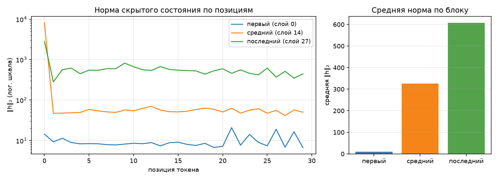

# Анатомия Qwen/Qwen3-0.6B

## Конфигурация

| Параметр | Значение |
|---|---:|
| num_hidden_layers | 28 |
| hidden_size | 1024 |
| intermediate_size | 3072 |
| num_attention_heads | 16 |
| num_key_value_heads | 8 |
| head_dim | 128 |
| vocab_size | 151936 |
| tie_word_embeddings | True |

Ревизия модели: `c1899de289a04d12100db370d81485cdf75e47ca`.

## Условия замера

| Условие | Значение |
|---|---|
| платформа | macOS-26.3.1-arm64-arm-64bit-Mach-O |
| устройство | mps |
| dtype весов | bfloat16 |
| seq_len × batch_size | 256 × 1 |
| прогонов на режим | 1, каждый в отдельном процессе; берётся максимум |
| метрика памяти | `torch.mps.driver_allocated_memory` |
| дополнительная метрика RSS | `ru_maxrss` |
| python | 3.14.0 |
| torch | 2.14.0 |
| transformers | 5.17.0 |
| peft | 0.20.0 |
| seed | 42 |

Все значения памяти — в МиБ (2²⁰ байт), как в лекции. Модель и длина 256 сохранены.
Инференс: один forward под `torch.inference_mode()`. Обучение: forward с labels,
backward и один шаг AdamW, затем `zero_grad(set_to_none=True)`.
Learning rate — 1e-05; остальные параметры AdamW стандартные.
Вход — случайные id токенов; KV-cache выключен во всех режимах (`use_cache=False`).
Gradient checkpointing и autocast не используются. Загрузка модели входит во время,
пик ускорителя снимается после загрузки и включает уже размещённые веса.

На MPS опрос драйвера идёт каждые 10 мс в отдельном потоке,
плюс замеры после синхронизации при загрузке, forward, backward и optimizer.step.
Это максимум наблюдений, а не аппаратный high-water mark: короткий пик между
отсчётами может быть пропущен. Метрика включает кэш аллокатора и буферы Metal.

## Параметры

| Группа | Модулей | Shape | Уникальных параметров | Доля | Tied |
|---|---:|---|---:|---:|---:|
| embed | 1 | 151936×1024 | 155 582 464 | 26.10% | 0 |
| q_proj | 28 | 2048×1024 | 58 720 256 | 9.85% | 0 |
| k_proj | 28 | 1024×1024 | 29 360 128 | 4.93% | 0 |
| v_proj | 28 | 1024×1024 | 29 360 128 | 4.93% | 0 |
| o_proj | 28 | 1024×2048 | 58 720 256 | 9.85% | 0 |
| gate_proj | 28 | 3072×1024 | 88 080 384 | 14.78% | 0 |
| up_proj | 28 | 3072×1024 | 88 080 384 | 14.78% | 0 |
| down_proj | 28 | 1024×3072 | 88 080 384 | 14.78% | 0 |
| norm | 113 | 128, 1024 | 65 536 | 0.01% | 0 |
| lm_head | 1 | 151936×1024 | 0 | 0.00% | 155 582 464 |
| **Итого** | | | **596 049 920** | **100%** | |

Прямой подсчёт `sum(p.numel() for p in model.parameters())` = 596 049 920.
`lm_head.weight` и `embed_tokens.weight` используют один тензор из 155 582 464 чисел.
В строке lm_head сохранена форма, но новых параметров — 0. Векторы RMSNorm:
`57 × 1024 + 56 × 128 = 65536`.
В Excel norm представлена одним суммарным вектором; фактически норм 113.

GQA: 16 Q-голов и 8 KV-голов по 128 чисел. Поэтому q_proj имеет 2048 строк,
а k_proj и v_proj — 1024. В MLP на блок `3 × 3072 × 1024 = 9 437 184` параметра,
во внимании — `6 291 456`: MLP тяжелее в 1,5 раза (44,33% против 29,55%).
RoPE не добавляет обучаемых параметров.

## Активации

Промпт: «Объясни, что такое MLOps, в трёх предложениях.». После chat template — 30 токенов.
На выходе блоков измеряется L2-норма hidden state каждого токена в float32.

| Блок | Индекс (с нуля) | Средняя L2-норма | Максимум | Позиция максимума |
|---|---:|---:|---:|---:|
| первый | 0 | 9.68 | 20.85 | 21 |
| средний | 14 | 325.49 | 8189.66 | 0 |
| последний | 27 | 606.88 | 2815.10 | 0 |

В pre-norm блоке обновляется `x + f(norm(x))`: residual-поток не нормализуется
целиком, поэтому его масштаб может расти с глубиной. Выбросы на ранних токенах
согласуются с massive activations из лекции. Одни нормы не доказывают attention sink:
для этого потребовалось бы отдельно измерить веса внимания.

## LoRA

Для матрицы `(out, in)` добавляются `A(r, in)` и `B(out, r)`:
`N = Σ r × (in + out)`. Bias отсутствует; lm_head в список целей не входит.

| Конфиг | Своя формула | peft | Доля базовой модели |
|---|---:|---:|---:|
| r=8, q_proj+v_proj | 1 146 880 | 1 146 880 | 0.1924% |
| r=16, все линейные | 10 092 544 | 10 092 544 | 1.6932% |

`r=8`: `28 × 8 × ((1024 + 2048) + (1024 + 1024)) = 1 146 880`.
`r=16`: `28 × 16 × (3072 + 2048 + 2048 + 3072 + 4096 + 4096 + 4096) = 10 092 544`.
`lora_alpha` равна 16 и 32 соответственно; dropout = 0. Alpha меняет масштаб,
но не число параметров. Обе суммы точно совпадают с `peft`.

## Память

| Режим | Пик, МиБ | RSS, МиБ | × к инференсу | Время, с | loss | PID |
|---|---:|---:|---:|---:|---:|---:|
| инференс | 2197.6 | 2057.6 | 1.00 | 3.1 | — | 18939 |
| full fine-tune | 6083.6 | 2057.8 | 2.77 | 3.8 | 14.0827 | 18942 |
| LoRA (r=8, q/v) | 3579.6 | 2058.0 | 1.63 | 3.2 | 14.0827 | 18945 |

Объём тензоров подсчитан отдельно через `numel() × element_size()`.
Градиенты сняты до zero_grad, состояния AdamW — после первого шага.

| Режим | Базовые веса, МиБ | Адаптер, МиБ | Градиенты, МиБ | AdamW, МиБ |
|---|---:|---:|---:|---:|
| инференс | 1136.88 | 0.00 | 0.00 | 0.00 |
| full fine-tune | 1136.88 | 0.00 | 1136.88 | 2273.75 |
| LoRA (r=8, q/v) | 1136.88 | 4.38 | 4.38 | 8.75 |

Веса bf16: `596049920 × 2 / 2²⁰ = 1136.88` МиБ.
Full FT добавляет 1136.88 МиБ градиентов и 2273.75 МиБ состояний AdamW: около ×4 от весов ещё до активаций.
Моменты AdamW здесь имеют dtype параметров; отдельной fp32 master-копии нет.
PEFT переводит адаптер в float32: 1146880 × 4 байта = 4.38 МиБ. Его градиенты и два момента занимают 13.13 МиБ.
Full FT выше инференса на 3886.0 МиБ, LoRA — на 1382.0 МиБ.
Разность пика и объёма постоянных тензоров нельзя целиком назвать активациями:
в неё входят logits, временные буферы операций и кэш драйвера, а их максимумы
могут приходиться на разные стадии. LoRA сохраняет активации для backward через
замороженные слои, поэтому экономия на градиентах не делает её равной инференсу.

В лекции на MPS получено 2222 / 7166 / 3606 МиБ; порядок режимов совпадает.
Точные версии библиотек и параметры аллокатора лекционного прогона не указаны,
поэтому разницу пиков нельзя однозначно приписать одной причине. Наши условия приведены выше.
В нашем замере RSS меняется на 0.4 МиБ.
На MPS буферы Metal лишь частично учитываются в RSS процесса, несмотря на общую
физическую память Apple Silicon. Поэтому основной столбец снят у драйвера.

## Четыре дефекта

1. **Хуки оставались на слоях.** Handles от register_forward_hook терялись,
   замыкания со словарями продолжали жить после вызова. Повтор добавлял ещё три хука.
   Теперь handles удаляются в finally, значения отделяются через detach,
   модель временно переводится в eval, а training-флаги всех модулей восстанавливаются.
   Проверка двух прогонов: хуков 0 → 0,
   массивы норм совпадают точно, режим восстановлен. Проверен и выход по исключению.
2. **Tied embeddings считались дважды.** Обход с remove_duplicate=False был нужен
   для строки lm_head, но все строки помечались tied=False. Теперь повтор определяется
   по id параметра и не входит в сумму уникальных весов.
   Было бы 751 632 384, стало 596 049 920;
   лишние 155 582 464 параметров убраны, сумма совпадает с model.parameters().
3. **Вместо пика снимался конец шага.** PeakMemory читал память только в __exit__,
   после gc.collect и обнуления градиентов. Дополнительно режимы запускались
   в одном процессе и наследовали high-water mark RSS. Теперь каждый режим запускается
   через subprocess; пик MPS собирается опросом и на границах стадий, CUDA — штатной
   пиковой метрикой. Разные PID приведены выше.
   Получено full FT 6083.6 > LoRA 3579.6 > инференс 2197.6 МиБ.
4. **На ускорителе измерялся RSS.** device_allocated_bytes и device_metric_source
   всегда вызывали peak_rss. Теперь выбор зависит от устройства: MPS —
   torch.mps.driver_allocated_memory, CUDA — torch.cuda.max_memory_allocated,
   CPU — ru_maxrss (macOS/Linux) или peak_wset (Windows). Источник в JSON и отчёте
   соответствует вызванной функции. RSS сохранён отдельным столбцом для сравнения.
   Минимальный пик 2197.6 МиБ выше весов 1136.88 МиБ.

Источники: задание, слайды 2–7; lecture2.html, слайды 4–14. Числа — docs/report.json.
